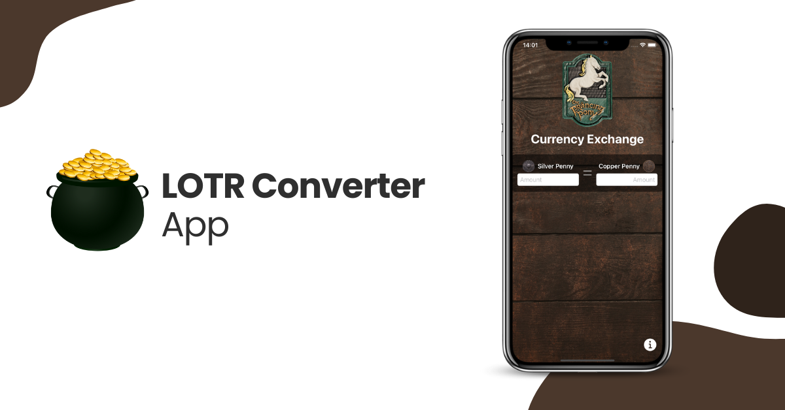
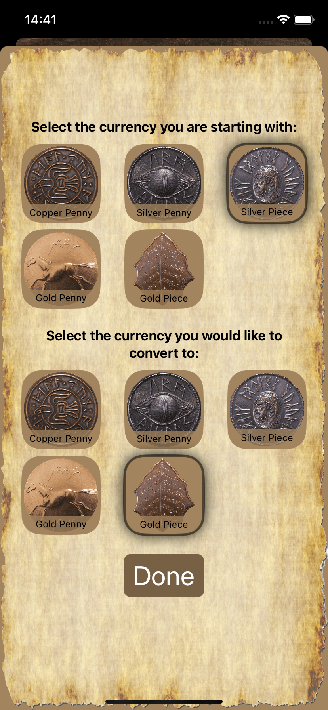
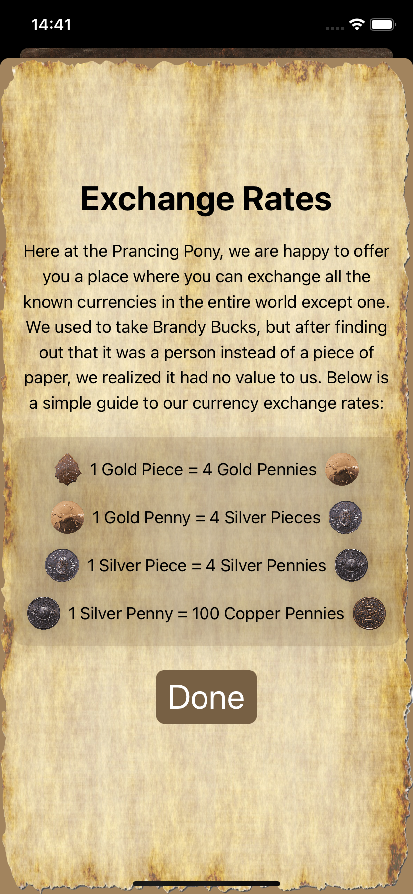
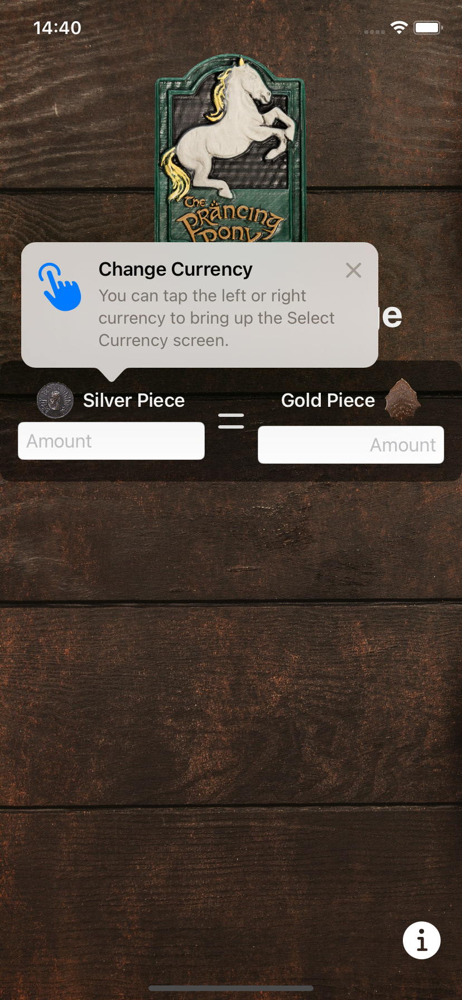

<h1 align="center">LOTR Converter 🪙</h1>

The application is an iOS app written in SwiftUI that features a system of fictional currencies which users can exchange.

## Some of the currencies are:

## You can see the exchange rate in this view:

## You can tap to see the other currencies that the app has:

## Credits

In this course, I’ve gained a solid foundation in building iOS apps using SwiftUI. I started with the basics... understanding variables, data types, and how to structure my code. Then, I explored SwiftUI’s powerful declarative syntax, learning how to design interfaces using stacks (VStack, HStack, and ZStack) to arrange views.

I also dove into state management, using @State for local view changes, @Binding to share data between views, and @Environment to access system-wide settings. SwiftUI’s modifiers helped me customize views with just a few lines of code, making styling and layout adjustments simple.

Thanks to Kenneth Jones from [kayjayapps](https://kayjayapps.com/)
